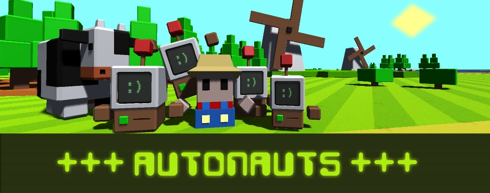

# Who or what are the Autonauts?
The 'Automationauts' (to give them their fuller, grander, longwindeder title) travel the universe with the sole goal of setting worlds in motion through the power of automation.

They harness whatever natural resources are available; they learn fast and can eventually make pretty much anything from anything. But their most important creations are workerbots, which can be made from the crudest of materials and taught to do anything an Autonaut can do so they can get on with helping species evolve.

# Screenshots
<image src="Media/Autonauts (1).gif" width="175px"/><image src="Media/Autonauts (2).gif" width="175px"/><image src="Media/Autonauts (3).gif" width="175px"/><image src="Media/Autonauts (4).gif" width="175px"/><image src="Media/Autonauts (5).gif" width="175px"/><image src="Media/Autonauts (6).gif" width="175px"/><image src="Media/Autonauts (7).gif" width="175px"/><image src="Media/Autonauts (8).gif" width="175px"/>

<image src="Media/Autonauts (1).png" width="175px"/><image src="Media/Autonauts (2).png" width="175px"/><image src="Media/Autonauts (3).png" width="175px"/><image src="Media/Autonauts (4).png" width="175px"/><image src="Media/Autonauts (5).png" width="175px"/><image src="Media/Autonauts (6).png" width="175px"/>
